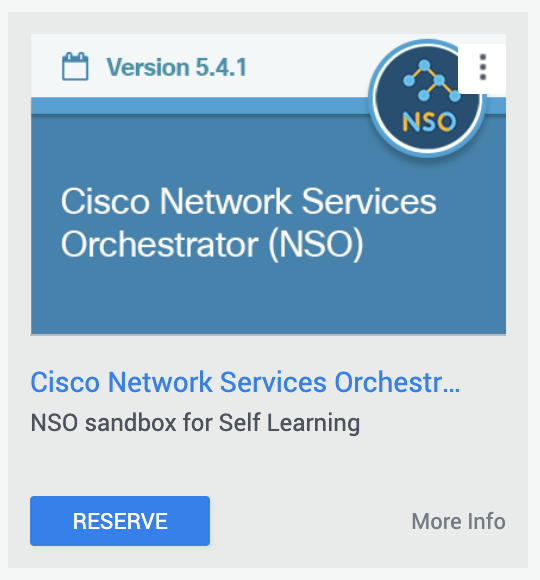
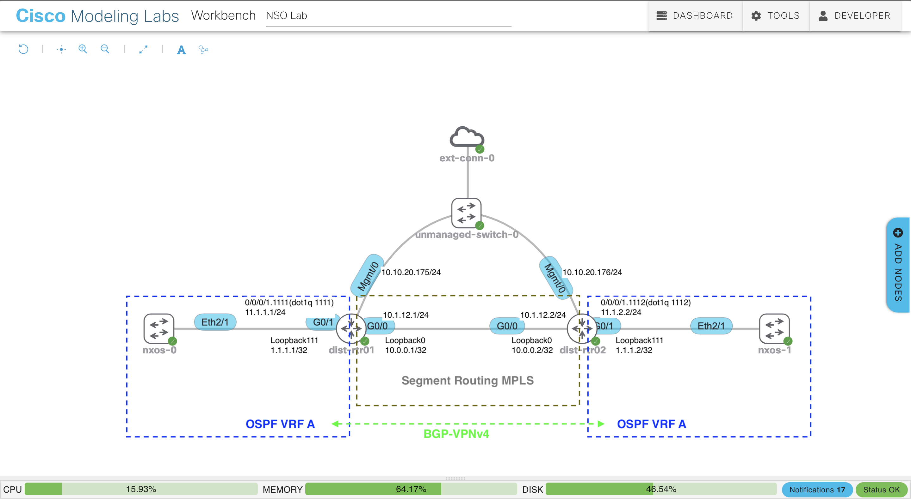
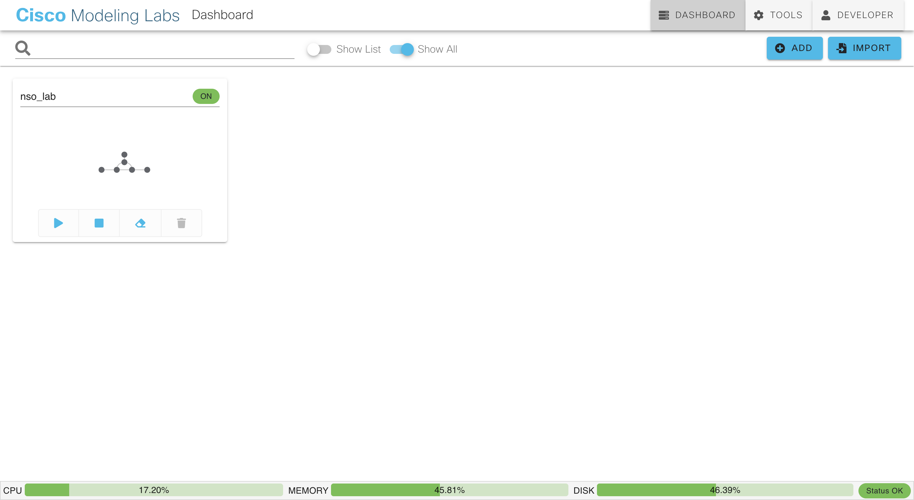
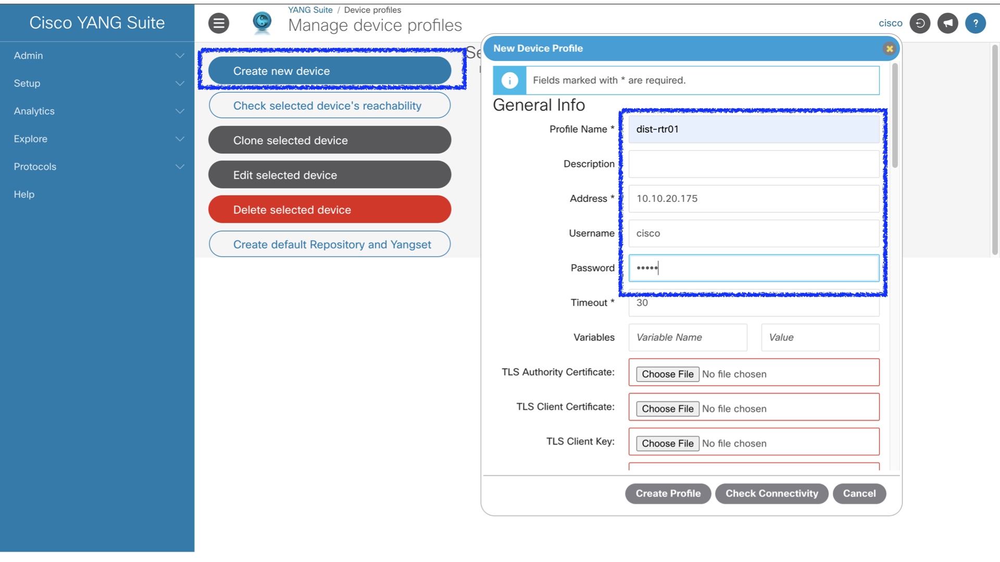
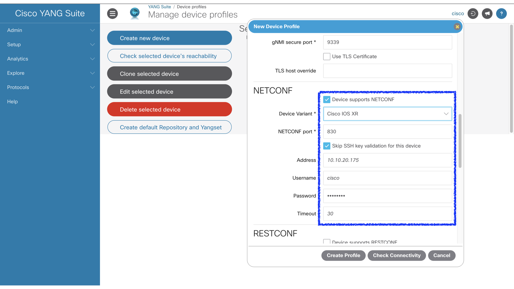
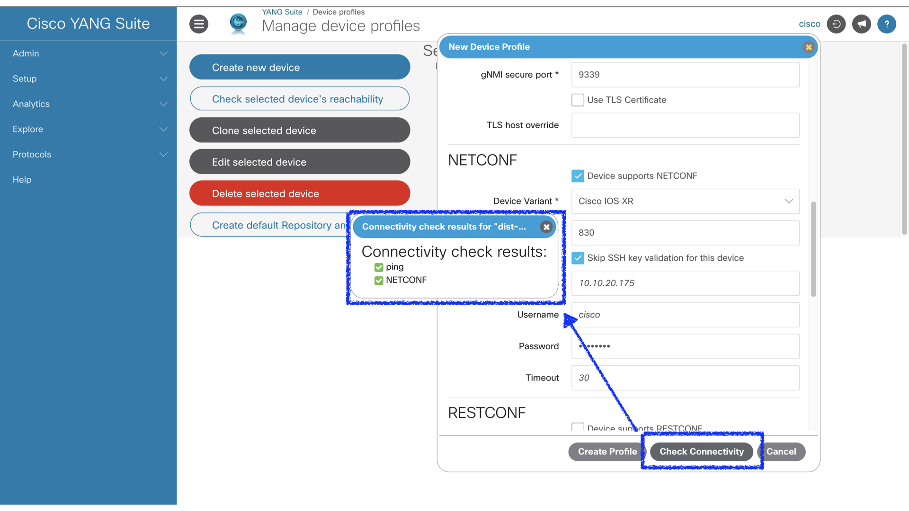

# Migration demo from CLI NED to NETCONF NED

## Overview

This repository demonstrates creating an IOS-XR NETCONF NED using the Cisco NSO service application in the DevNet sandbox and migrating from the NED to the created NETCONF NED.

The target configuration of NETCONF NED is L3VPN addition to SR-MPLS.


## Requirements

An account that has permission to access the Cisco DevNet sandbox.

## Sandbox used in this demo

Cisco Network Services Orchestrator (NSO)



## What you do is

1. Connect to the sandbox
2. Change lab network in CML2
3. Apply CLI NED to new lab network
4. Install Cisco YANG Suite
5. Select YANG module to create NETCONF NED
6. Create NETCONF NED
7. Apply NETCONF NED to new lab network
8. Try to configure

## 1. Connect to the sandbox

Connect to Cisco Network Services Orchestrator (NSO) referring to [here](https://developer.cisco.com/docs/sandbox/ "Devnet Sandbox Document").

## 2. Change lab network in CML2

In this demo, we will leave the distribution routers and remove the rest of the nodes. Replace the remaining IOS-XE routers with IOS-XR routers, then set up a segment routing MPLS cloud between them and build an L3VPN using BGP VPNv4.



You can build this lab by running cml2.py from DevBox.

Log in to DevBox.

```shell
$ ssh -l developer 10.10.20.50
developer@10.10.20.50's password:
Last login: Tue Jul 14 05:34:45 2020
(py3venv) [developer@devbox ~]$
```

Clone the iosxr-nc-ned repository.

```shell
(py3venv) [developer@devbox ~]$ git clone https://github.com/masanobu48154/iosxr-nc-ned.git
Cloning into 'iosxr-nc-ned'...
remote: Enumerating objects: 18, done.
remote: Counting objects: 100% (18/18), done.
remote: Compressing objects: 100% (14/14), done.
remote: Total 18 (delta 2), reused 11 (delta 1), pack-reused 0
Unpacking objects: 100% (18/18), done.
(py3venv) [developer@devbox ~]$ 
```

Go to the iosxr-nc-ned directory and set the CML2 username and password as environment variables.

```shell
(py3venv) [developer@devbox ~]$ cd iosxr-nc-ned/
(py3venv) [developer@devbox iosxr-nc-ned]$ export CML_USERNAME={ CML USERNAME }
(py3venv) [developer@devbox iosxr-nc-ned]$ export CML_PASSWORD={ CML PASSWORD }
```

Run cml2.py.

```shell
(py3venv) [developer@devbox iosxr-nc-ned]$ python3 cml2.py
```

Go to https://10.10.20.161 and log in to CML to verify that nso_lob has been imported.



## 3. Apply CLI NED to new lab network

In the original lab network, dist-rtr01 and dist-rtr02 had IOS CLI NED applied, so change them to IOS-XR CLI NED to match the new lab network.

Log in to NSO/NCS Host.

```shell
$ ssh -l developer 10.10.20.49
developer@10.10.20.49's password:
Last login: Tue Jan 10 17:35:21 2023 from 192.168.254.13
[developer@nso ~]$
```

Go to NSO CLI shell mode.

```shell
[developer@nso ~]$ ncs_cli -C -u developer

User developer last logged in 2023-01-10T14:38:18.25607-08:00, to nso, from 10.10.20.49 using rest-https
developer connected from 192.168.254.13 using ssh on nso
developer@ncs#
```

Check the NED of dist-rtr01.

```conf
developer@ncs# show running-config devices device dist-rtr01 | include ned-id
 device-type cli ned-id cisco-ios-cli-6.67
developer@ncs#
```

Attempting to sync dist-rtr config to NSO fails. This is because IOS-XE has been replaced by IOS-XR in the new lab network.

```conf
developer@ncs# devices device dist-rtr01 sync-from
result false
info Failed to connect to device dist-rtr01: connection refused: Failed to setup NED :: Unknown device ::
Wed Jan 11 22:30:44.511 UTC
Cisco IOS XR Software, Version 7.2.2
Copyright (c) 2013-2021 by Cisco Systems, Inc.

Build Information:
 Built By     : ingunawa
 Built On     : Mon Jan 25 21:30:50 PST 2021
 Built Host   : iox-ucs-012
 Workspace    : /auto/srcarchive15/prod/7.2.2/xrv9k/ws
 Version      : 7.2.2
 Location     : /opt/cisco/XR/packages/
 Label        : 7.2.2-0

cisco IOS-XRv 9000 () processor
System uptime is 12 hours 6 minutes
```

Change NED of `dist-rtr-01` to `cisco-iosxr-cli-7.32` .

```conf
developer@ncs# config terminal
Entering configuration mode terminal
developer@ncs(config)# devices device dist-rtr01 device-type cli ned-id cisco-iosxr-cli-7.32
```

Migrate to the new NED and commit.

```conf
developer@ncs(config-device-dist-rtr01)# migrate new-ned-id cisco-iosxr-cli-7.32
modified-path {
    path /devices/device[name='dist-rtr01']/config/ios:memory
    info sub-tree has been deleted
}
modified-path {
    path /devices/device[name='dist-rtr01']/config/ios:router
    info sub-tree has been deleted
}
modified-path {
    path /devices/device[name='dist-rtr01']/config/ios:diagnostic
    info sub-tree has been deleted
}
modified-path {
    path /devices/device[name='dist-rtr01']/config/ios:spanning-tree
    info sub-tree has been deleted
}
modified-path {
    path /devices/device[name='dist-rtr01']/config/ios:logging
    info sub-tree has been deleted
}
modified-path {
    path /devices/device[name='dist-rtr01']/config/ios:line
    info sub-tree has been deleted
}
modified-path {
    path /devices/device[name='dist-rtr01']/config/ios:interface
    info sub-tree has been deleted
}
modified-path {
    path /devices/device[name='dist-rtr01']/config/ios:crypto
    info sub-tree has been deleted
}
modified-path {
    path /devices/device[name='dist-rtr01']/config/ios:username
    info sub-tree has been deleted
}
modified-path {
    path /devices/device[name='dist-rtr01']/config/ios:multilink
    info sub-tree has been deleted
}
modified-path {
    path /devices/device[name='dist-rtr01']/config/ios:subscriber
    info sub-tree has been deleted
}
modified-path {
    path /devices/device[name='dist-rtr01']/config/ios:ip
    info sub-tree has been deleted
}
modified-path {
    path /devices/device[name='dist-rtr01']/config/ios:call-home
    info sub-tree has been deleted
}
modified-path {
    path /devices/device[name='dist-rtr01']/config/ios:enable
    info sub-tree has been deleted
}
modified-path {
    path /devices/device[name='dist-rtr01']/config/ios:vrf
    info sub-tree has been deleted
}
modified-path {
    path /devices/device[name='dist-rtr01']/config/ios:platform
    info sub-tree has been deleted
}
modified-path {
    path /devices/device[name='dist-rtr01']/config/ios:login
    info sub-tree has been deleted
}
modified-path {
    path /devices/device[name='dist-rtr01']/config/ios:service
    info sub-tree has been deleted
}
modified-path {
    path /devices/device[name='dist-rtr01']/config/ios:version
    info sub-tree has been deleted
}
modified-path {
    path /devices/device[name='dist-rtr01']/config/ios:tailfned
    info sub-tree has been deleted
}
modified-path {
    path /devices/device[name='dist-rtr01']/config/ios:hostname
    info sub-tree has been deleted
}
developer@ncs(config-device-dist-rtr01)# commit
Commit complete.
developer@ncs(config-device-dist-rtr01)#
```

sync `dist-rtr-01` config to NSO.

```conf
developer@ncs(config-device-dist-rtr01)# top
developer@ncs(config)# devices device dist-rtr01 sync-from
result true
developer@ncs(config)#
```

`dist-rtr-02` to the new NED as well. And check the running-config with `show running-config devices device { DEVICE } config `.

## 4. Install Cisco YANG Suite

Before building NED with NSO, let's install the very cool [Cisco YANG Suite](https://github.com/CiscoDevNet/yangsuite "Cisco YANG Suite") in DevBox to select the YANG modules we need.

Log in to DevBox.

```shell
$ ssh -l developer 10.10.20.50
developer@10.10.20.50's password:
Last login: Tue Jul 14 05:34:45 2020
(py3venv) [developer@devbox ~]$
```

Clone the yangsuite repository.

```shell
(py3venv) [developer@devbox ~]$ git clone https://github.com/CiscoDevNet/yangsuite
Cloning into 'yangsuite'...
remote: Enumerating objects: 847, done.
remote: Counting objects: 100% (52/52), done.
remote: Compressing objects: 100% (37/37), done.
remote: Total 847 (delta 26), reused 27 (delta 15), pack-reused 795
Receiving objects: 100% (847/847), 44.85 MiB | 26.44 MiB/s, done.
Resolving deltas: 100% (352/352), done.
(py3venv) [developer@devbox ~]$
```

Go to the yangsuite/docker directory and replace `localhost` in each configuration file with `10.10.20.50`.

```shell
(py3venv) [developer@devbox ~]$ cd yangsuite/docker/
(py3venv) [developer@devbox docker]$ sed -i s/localhost/10.10.20.50/g start_yang_suite.sh
(py3venv) [developer@devbox docker]$ sed -i s/localhost/10.10.20.50/g ./nginx/nginx.conf
(py3venv) [developer@devbox docker]$ sed -i s/localhost/10.10.20.50/g ./yangsuite/Dockerfile
(py3venv) [developer@devbox docker]$ sed -i s/localhost/10.10.20.50/g ./yangsuite/production.py
(py3venv) [developer@devbox docker]$ 
```

Running start_yang_suite.sh will ask to set the　username, password, email address, and certificate details. The output will look similar to the below

```shell
(py3venv) [developer@devbox docker]$ bash ./start_yang_suite.sh
Hello, please setup YANG Suite admin user.
username: cisco
password:
confirm password:
email: example@virl.info

Setup test certificates? (y/n): y
################################################################
## Generating self-signed certificates...                     ##
##                                                            ##
## WARNING: Obtain certificates from a trusted authority!     ##
##                                                            ##
## NOTE: Some browsers may still reject these certificates!!  ##
################################################################

Generating a 2048 bit RSA private key
................+++
....+++
writing new private key to 'nginx/nginx-self-signed.key'
-----
You are about to be asked to enter information that will be incorporated
into your certificate request.
What you are about to enter is what is called a Distinguished Name or a DN.
There are quite a few fields but you can leave some blank
For some fields there will be a default value,
If you enter '.', the field will be left blank.
-----
Country Name (2 letter code) [XX]:JP
State or Province Name (full name) []:OSAKA
Locality Name (eg, city) [Default City]:OSAKA
Organization Name (eg, company) [Default Company Ltd]:VIRL
Organizational Unit Name (eg, section) []:VIRL
Common Name (eg, your name or your server's hostname) []:10.10.20.50
Email Address []:example@virl.info
Certificates generated...
Building docker containers...
Creating network "docker_default" with the default driver
Creating volume "docker_static-content" with default driver
Creating volume "docker_uwsgi" with default driver
Building yangsuite
Step 1/22 : FROM ubuntu:20.04
20.04: Pulling from library/ubuntu
846c0b181fff: Pull complete

(snip)
```

When YANG Suite is ready to use, it will be displayed as below.

```shell
yangsuite_1  | spawned uWSGI master process (pid: 53)
yangsuite_1  | spawned uWSGI worker 1 (pid: 62, cores: 1)
yangsuite_1  | spawned uWSGI worker 2 (pid: 63, cores: 1)
yangsuite_1  | spawned uWSGI worker 3 (pid: 64, cores: 1)
yangsuite_1  | spawned uWSGI worker 4 (pid: 65, cores: 1)
yangsuite_1  | spawned uWSGI worker 5 (pid: 66, cores: 1)
```

Now you can access the YANG Suite at http://10.10.20.50

## 5. Select YANG module to create NETCONF NED

Since the target configuration of NETCONF NED is adding L3VPN to SR-MPLS, the necessary YANG modules can be expected to be VRF, INTERFACE, OSPF, and BGP.You can use YANG Suite to select the modules we need.

### __Create New Device Profile__

Create a profile for your device to download and try YANG modules.

Log in to Cisco YANG Suite with the username and password you specified when installing, and register `General Info` and `NETCONF`of dist-rtr01 from `Device profiles`.

> __Setup__ => __Device profiles__ => __Create new device__ 
> - define "General Info".



> Also define "NETCONF" as below.



> Click "Check connectivity".



### __Create New Repositry__

Create a `New repository` from `YANG files and repositories` and download all YANG modules from dist-rtr01.

> __Setup__ => __YANG files and repositories__ => __New repositry__
> - Define any repository name.


> - Select the created device profile from the `NETCONF` tab of `Add modules to repository`.
> - Click `Get schema list`.


> - Select and download all of the displayed schemas list.
>
>    Once the download is completed, it will be displayed in `YANG modules in repository` on the left.


### __Create VRF Feature Module Set__

Now, let's create a VRF YANG module set to get the VRF configuration from the device and set the VRF to the device.

> __Setup__ => __YANG module sets__ => __New YANG set__
> 
> - Select the created YANG repositories and define the YANG set name.


> - Type __vrf__ in the search box.

Search for modules that seem to be related to VRF from the repository. Guessing from the name of the module, Cisco-IOS-XR-um-vrf-cfg 2020-07-23 is probably the desired module.

> - Select __Cisco-IOS-XR-um-vrf-cfg 2020-07-23__ and include it in the module set.
> - Click __Locate and add missing dependencies__.


A module set of VRF functionality is created, with dependencies between modules resolved as well.
The modules that make up the module set are:
- __Cisco-IOS-XR-um-vrf-cfg 2020-07-23__
- __Cisco-IOS-XR-config-mda-cfg 2019-04-05__
- __Cisco-IOS-XR-types 2019-12-03__
- __cisco-semver 2019-03-13__
- __ietf-inet-types 2013-07-15__


Let's verify with NETCONF that the VRF config can be pulled from the device.

> __Protocols__ => __NETCONF__ => __New YANG set__
> - Select the VRF feature module set created in the previous step for __YANG Set__.
> - Select __Cisco-IOS-XR-um-vrf-cfg__ for __Module(s)__.
> - Click __Load Module(s)__.


> - Select __get-config__ for __NETCONF Operation__.
> - Select __dist-rtr01__ for __Device__.
> - Mark __vrf list node__ in the displayed YANG model tree.
> - Click __Build RPC__.


> - Click __Run RPC(s)__.


You can pull the config with NETCONF like below.

Modules found in the repository that augment the modules in this YANG set.

YANG Suite also finds __Cisco-IOS-XR-um-router-bgp-cfg__, a module that augments __Cisco-IOS-XR-um-vrf-cfg__.
This module is also required when creating a NED.
- __Cisco-IOS-XR-um-router-bgp-cfg__

```xml
<rpc-reply xmlns:nc="urn:ietf:params:xml:ns:netconf:base:1.0" xmlns="urn:ietf:params:xml:ns:netconf:base:1.0" message-id="urn:uuid:b2af9bf7-797d-431f-af81-0d8ecfda6584">
 <data>
  <vrfs xmlns="http://cisco.com/ns/yang/Cisco-IOS-XR-um-vrf-cfg">
   <vrf>
    <vrf-name>A</vrf-name>
    <address-family>
     <ipv4>
      <unicast>
       <import xmlns="http://cisco.com/ns/yang/Cisco-IOS-XR-um-router-bgp-cfg">
        <route-target>
         <two-byte-as-rts>
          <two-byte-as-rt>
           <as-number>65432</as-number>
           <index>1111</index>
           <stitching>false</stitching>
          </two-byte-as-rt>
         </two-byte-as-rts>
        </route-target>
       </import>
       <export xmlns="http://cisco.com/ns/yang/Cisco-IOS-XR-um-router-bgp-cfg">
        <route-target>
         <two-byte-as-rts>
          <two-byte-as-rt>
           <as-number>65432</as-number>
           <index>1111</index>
           <stitching>false</stitching>
          </two-byte-as-rt>
         </two-byte-as-rts>
        </route-target>
       </export>
      </unicast>
     </ipv4>
    </address-family>
   </vrf>
   <vrf>
    <vrf-name>Mgmt-intf</vrf-name>
    <address-family>
     <ipv4>
      <unicast/>
     </ipv4>
     <ipv6>
      <unicast/>
     </ipv6>
    </address-family>
   </vrf>
  </vrfs>
 </data>
</rpc-reply>
```

### __Create INTERFACE Feature Module Set__

Create a module set for the INTERFACE feature in the same way.

> - Type __interface__ in the search box.

You will find modules defined by ietf, openconfig and cisco. 

First, let's verify from ietf.

> - Select __ietf-interfaces 2014-05-08__ and include it in the module set.
> - Click __Locate and add missing dependencies__.


A module set of INTERFACE features is created that also incorporates dependent modules.


> - Select the VRF feature module set created in the previous step for __INTERFACE YANG Set__.
> - Select __ietf-interfaces__ for __Module(s)__.
> - Click __Load Module(s)__.
> - Select __get-config__ for __NETCONF Operation__.
> - Select __dist-rtr01__ for __Device__.
> - Mark __interface list node__ in the displayed YANG model tree.
> - Click __Build RPC__.
> - Click __Run RPC(s)__.


You won't be able to pull the config like below.

```xml
<rpc-reply xmlns:nc="urn:ietf:params:xml:ns:netconf:base:1.0" xmlns="urn:ietf:params:xml:ns:netconf:base:1.0" message-id="urn:uuid:d5a107f4-6423-4667-968c-00494a83cf83">
 <data/>
</rpc-reply>
```


Next, let's verify with a module set that includes __openconfig-interfaces 2016-05-26__.


Load __openconfig-interfaces__ and mark the __interface list node__ to __run RPC__.


You can pull the config with NETCONF like below.

The __interface__ config was pulled. It looks like you've pulled it off perfectly, but you're missing a __vrf__ definition.

```xml
<rpc-reply xmlns:nc="urn:ietf:params:xml:ns:netconf:base:1.0" xmlns="urn:ietf:params:xml:ns:netconf:base:1.0" message-id="urn:uuid:e04176c2-a832-4618-8fb1-6528e8d939bc">
 <data>
  <interfaces xmlns="http://openconfig.net/yang/interfaces">
   <interface>
    <name>Loopback0</name>
    <config>
     <name>Loopback0</name>
     <type xmlns:idx="urn:ietf:params:xml:ns:yang:iana-if-type">idx:softwareLoopback</type>
    </config>
    <subinterfaces>
     <subinterface>
      <index>0</index>
      <ipv4 xmlns="http://openconfig.net/yang/interfaces/ip">
       <addresses>
        <address>
         <ip>10.0.0.1</ip>
         <config>
          <ip>10.0.0.1</ip>
          <prefix-length>32</prefix-length>
         </config>
        </address>
       </addresses>
      </ipv4>
     </subinterface>
    </subinterfaces>
   </interface>
   <interface>
    <name>Loopback111</name>
    <config>
     <name>Loopback111</name>
     <type xmlns:idx="urn:ietf:params:xml:ns:yang:iana-if-type">idx:softwareLoopback</type>
    </config>
    <subinterfaces>
     <subinterface>
      <index>0</index>
      <ipv4 xmlns="http://openconfig.net/yang/interfaces/ip">
       <addresses>
        <address>
         <ip>1.1.1.1</ip>
         <config>
          <ip>1.1.1.1</ip>
          <prefix-length>32</prefix-length>
         </config>
        </address>
       </addresses>
      </ipv4>
     </subinterface>
    </subinterfaces>
   </interface>
   <interface>
    <name>MgmtEth0/RP0/CPU0/0</name>
    <config>
     <name>MgmtEth0/RP0/CPU0/0</name>
     <type xmlns:idx="urn:ietf:params:xml:ns:yang:iana-if-type">idx:ethernetCsmacd</type>
    </config>
    <ethernet xmlns="http://openconfig.net/yang/interfaces/ethernet">
     <config>
      <auto-negotiate>false</auto-negotiate>
     </config>
    </ethernet>
    <subinterfaces>
     <subinterface>
      <index>0</index>
      <ipv4 xmlns="http://openconfig.net/yang/interfaces/ip">
       <addresses>
        <address>
         <ip>10.10.20.175</ip>
         <config>
          <ip>10.10.20.175</ip>
          <prefix-length>24</prefix-length>
         </config>
        </address>
       </addresses>
      </ipv4>
     </subinterface>
    </subinterfaces>
   </interface>
   <interface>
    <name>GigabitEthernet0/0/0/0</name>
    <config>
     <name>GigabitEthernet0/0/0/0</name>
     <type xmlns:idx="urn:ietf:params:xml:ns:yang:iana-if-type">idx:ethernetCsmacd</type>
     <description>to_port0_dist_rtr02</description>
    </config>
    <ethernet xmlns="http://openconfig.net/yang/interfaces/ethernet">
     <config>
      <auto-negotiate>false</auto-negotiate>
     </config>
    </ethernet>
    <subinterfaces>
     <subinterface>
      <index>0</index>
      <ipv4 xmlns="http://openconfig.net/yang/interfaces/ip">
       <addresses>
        <address>
         <ip>10.1.12.1</ip>
         <config>
          <ip>10.1.12.1</ip>
          <prefix-length>24</prefix-length>
         </config>
        </address>
       </addresses>
      </ipv4>
     </subinterface>
    </subinterfaces>
   </interface>
   <interface>
    <name>GigabitEthernet0/0/0/1</name>
    <config>
     <name>GigabitEthernet0/0/0/1</name>
     <type xmlns:idx="urn:ietf:params:xml:ns:yang:iana-if-type">idx:ethernetCsmacd</type>
     <description>to_user</description>
    </config>
    <ethernet xmlns="http://openconfig.net/yang/interfaces/ethernet">
     <config>
      <auto-negotiate>false</auto-negotiate>
     </config>
    </ethernet>
    <subinterfaces>
     <subinterface>
      <index>1111</index>
      <config>
       <index>1111</index>
      </config>
      <ipv4 xmlns="http://openconfig.net/yang/interfaces/ip">
       <addresses>
        <address>
         <ip>11.1.1.1</ip>
         <config>
          <ip>11.1.1.1</ip>
          <prefix-length>24</prefix-length>
         </config>
        </address>
       </addresses>
      </ipv4>
      <vlan xmlns="http://openconfig.net/yang/vlan">
       <config>
        <vlan-id>1111</vlan-id>
       </config>
      </vlan>
     </subinterface>
    </subinterfaces>
   </interface>
  </interfaces>
 </data>
</rpc-reply>
```


Finally, let's verify with a module set that includes __Cisco-IOS-XR-um-interface-cfg 2019-06-10__.

The modules that make up the module set are:
- __Cisco-IOS-XR-um-interface-cfg 2019-06-10__
- __Cisco-IOS-XR-types 2019-12-03__
- __cisco-semver 2019-03-13__
- __ietf-inet-types 2013-07-15__
- __tailf-cli-extensions 2018-09-11__
- __tailf-common 2018-09-11__
- __tailf-meta-extensions 2017-03-08__


Load __Cisco-IOS-XR-um-interface-cfg__ and mark the __interface list node__ to __run RPC__.


You can pull the config with NETCONF like below.

Interface configuration pulled. There is also a VRF definition, so the INTERFACE Feature will be fine with this module set.

YANG Suite also detects some modules that augment __Cisco-IOS-XR-um-interface-cfg__.
These modules are also required when creating a NED.
- __Cisco-IOS-XR-um-if-ip-address-cfg__
- __Cisco-IOS-XR-um-if-vrf-cfg__
- __Cisco-IOS-XR-um-if-vrf-cfg__
- __Cisco-IOS-XR-um-l2-ethernet-cfg__

```xml
<rpc-reply xmlns:nc="urn:ietf:params:xml:ns:netconf:base:1.0" xmlns="urn:ietf:params:xml:ns:netconf:base:1.0" message-id="urn:uuid:4341816b-6c9a-4cf0-9d7c-300859a5e913">
 <data>
  <interfaces xmlns="http://cisco.com/ns/yang/Cisco-IOS-XR-um-interface-cfg">
   <interface>
    <interface-name>Loopback0</interface-name>
    <ipv4>
     <addresses xmlns="http://cisco.com/ns/yang/Cisco-IOS-XR-um-if-ip-address-cfg">
      <address>
       <address>10.0.0.1</address>
       <netmask>255.255.255.255</netmask>
      </address>
     </addresses>
    </ipv4>
   </interface>
   <interface>
    <interface-name>Loopback111</interface-name>
    <vrf xmlns="http://cisco.com/ns/yang/Cisco-IOS-XR-um-if-vrf-cfg">A</vrf>
    <ipv4>
     <addresses xmlns="http://cisco.com/ns/yang/Cisco-IOS-XR-um-if-ip-address-cfg">
      <address>
       <address>1.1.1.1</address>
       <netmask>255.255.255.255</netmask>
      </address>
     </addresses>
    </ipv4>
   </interface>
   <interface>
    <interface-name>MgmtEth0/RP0/CPU0/0</interface-name>
    <vrf xmlns="http://cisco.com/ns/yang/Cisco-IOS-XR-um-if-vrf-cfg">Mgmt-intf</vrf>
    <ipv4>
     <addresses xmlns="http://cisco.com/ns/yang/Cisco-IOS-XR-um-if-ip-address-cfg">
      <address>
       <address>10.10.20.175</address>
       <netmask>255.255.255.0</netmask>
      </address>
     </addresses>
    </ipv4>
   </interface>
   <interface>
    <interface-name>GigabitEthernet0/0/0/0</interface-name>
    <description>to_port0_dist_rtr02</description>
    <ipv4>
     <addresses xmlns="http://cisco.com/ns/yang/Cisco-IOS-XR-um-if-ip-address-cfg">
      <address>
       <address>10.1.12.1</address>
       <netmask>255.255.255.0</netmask>
      </address>
     </addresses>
    </ipv4>
   </interface>
   <interface>
    <interface-name>GigabitEthernet0/0/0/1</interface-name>
    <description>to_user</description>
   </interface>
   <interface>
    <interface-name>GigabitEthernet0/0/0/1.1111</interface-name>
    <vrf xmlns="http://cisco.com/ns/yang/Cisco-IOS-XR-um-if-vrf-cfg">A</vrf>
    <ipv4>
     <addresses xmlns="http://cisco.com/ns/yang/Cisco-IOS-XR-um-if-ip-address-cfg">
      <address>
       <address>11.1.1.1</address>
       <netmask>255.255.255.0</netmask>
      </address>
     </addresses>
    </ipv4>
    <encapsulation xmlns="http://cisco.com/ns/yang/Cisco-IOS-XR-um-l2-ethernet-cfg">
     <dot1q>
      <vlan-id>1111</vlan-id>
     </dot1q>
    </encapsulation>
   </interface>
  </interfaces>
 </data>
</rpc-reply>
```

### __Create BGP Feature Module Set__

After creating some module sets, you can see that there are many __Cisco-IOS-XR-um__ modules.

You can effectively create a module set using a UM model generated directly from the CLI. 

> #### __[Transitioning Native Models to Unified Models (UM)](https://www.cisco.com/c/en/us/td/docs/routers/asr9000/software/asr9k-r7-8/programmability/configuration/guide/b-programmability-cg-asr9000-78x/m-unified-data-models.html#Cisco_Reference.dita_e135d1e5-f314-44d9-a59a-716bad643369 "Transitioning Native Models to Unified Models (UM)")__
> 
> Unified models are CLI-based YANG models that are designed to replace the native schema-based models. UM models are generated directly from the IOS XR CLIs and mirror them in several ways. This results in improved usability and faster adoption of YANG models.

Now create a BGP module set using the UM model.

> - Type __bgp__ in the search box.
> - Select __Cisco-IOS-XR-um-router-bgp-cfg 2020-11-10__ and include it in the module set.
> - Click __Locate and add missing dependencies__.

The modules that make up BGP modules set with resolved dependencies are:
- __Cisco-IOS-XR-um-router-bgp-cfg 2020-11-10__
- __Cisco-IOS-XR-config-mda-cfg 2019-04-05__
- __Cisco-IOS-XR-types 2019-12-03__
- __Cisco-IOS-XR-um-snmp-server-cfg 2019-06-10__
- __Cisco-IOS-XR-um-vrf-cfg 2020-07-23__
- __cisco-semver 2019-03-13__
- __ietf-inet-types 2013-07-15__


Load __Cisco-IOS-XR-um-router-bgp-cfg__ and mark the __bgp container node__ to __run RPC__.


You can pull the config with NETCONF like below.

```xml
<rpc-reply xmlns:nc="urn:ietf:params:xml:ns:netconf:base:1.0" xmlns="urn:ietf:params:xml:ns:netconf:base:1.0" message-id="urn:uuid:30636c3e-fe55-480b-9bfe-e99e9fbc8d9e">
 <data>
  <router xmlns="http://cisco.com/ns/yang/Cisco-IOS-XR-um-router-bgp-cfg">
   <bgp>
    <as>
     <as-number>65432</as-number>
     <bgp>
      <router-id>10.0.0.1</router-id>
      <log>
       <neighbor>
        <changes>
         <detail/>
        </changes>
       </neighbor>
      </log>
     </bgp>
     <address-families>
      <address-family>
       <af-name>vpnv4-unicast</af-name>
      </address-family>
     </address-families>
     <neighbors>
      <neighbor>
       <neighbor-address>10.0.0.2</neighbor-address>
       <remote-as>65432</remote-as>
       <update-source>Loopback0</update-source>
       <address-families>
        <address-family>
         <af-name>vpnv4-unicast</af-name>
        </address-family>
       </address-families>
      </neighbor>
     </neighbors>
     <vrfs>
      <vrf>
       <vrf-name>A</vrf-name>
       <rd>
        <two-byte-as>
         <as-number>65432</as-number>
         <index>1111</index>
        </two-byte-as>
       </rd>
       <address-families>
        <address-family>
         <af-name>ipv4-unicast</af-name>
         <redistribute>
          <ospf>
           <router-tag>A</router-tag>
          </ospf>
         </redistribute>
        </address-family>
       </address-families>
      </vrf>
     </vrfs>
    </as>
   </bgp>
  </router>
 </data>
</rpc-reply>
```

### __Create OSPF Feature Module Set__

Create OSPF feature module set using UM model.

The modules that make up OSPF module set with resolved dependencies are:
- __Cisco-IOS-XR-um-router-ospf-cfg 2020-09-28__
- __Cisco-IOS-XR-types 2019-12-03__
- __Cisco-IOS-XR-um-snmp-server-cfg 2019-06-10__
- __cisco-semver 2019-03-13__
- __ietf-inet-types 2013-07-15__
- __tailf-cli-extensions 2018-09-11__
- __tailf-common 2018-09-11__
- __tailf-meta-extensions 2017-03-08__


Load __Cisco-IOS-XR-um-router-ospf-cfg 2020-09-28__ and mark the __ospf container node__ to __run RPC__.


You can pull the config with NETCONF like below.

```xml
<rpc-reply xmlns:nc="urn:ietf:params:xml:ns:netconf:base:1.0" xmlns="urn:ietf:params:xml:ns:netconf:base:1.0" message-id="urn:uuid:14bbcd72-8140-4397-942d-183c8a165f58">
 <data>
  <router xmlns="http://cisco.com/ns/yang/Cisco-IOS-XR-um-router-ospf-cfg">
   <ospf>
    <processes>
     <process>
      <process-name>1</process-name>
      <router-id>10.0.0.1</router-id>
      <segment-routing>
       <mpls/>
      </segment-routing>
      <address-family>
       <ipv4>
        <unicast/>
       </ipv4>
      </address-family>
      <areas>
       <area>
        <area-id>0</area-id>
        <interfaces>
         <interface>
          <interface-name>Loopback0</interface-name>
          <network>
           <point-to-point/>
          </network>
          <passive>
           <enable/>
          </passive>
          <prefix-sid>
           <index>
            <sid-index>1</sid-index>
           </index>
          </prefix-sid>
         </interface>
         <interface>
          <interface-name>GigabitEthernet0/0/0/0</interface-name>
          <network>
           <point-to-point/>
          </network>
         </interface>
        </interfaces>
       </area>
      </areas>
     </process>
     <process>
      <process-name>A</process-name>
      <vrfs>
       <vrf>
        <vrf-name>A</vrf-name>
        <router-id>1.1.1.1</router-id>
        <redistribute>
         <bgp>
          <as>
           <as-number>65432</as-number>
           <metric>
            <default-metric>10</default-metric>
           </metric>
           <metric-type>2</metric-type>
          </as>
         </bgp>
        </redistribute>
        <address-family>
         <ipv4>
          <unicast/>
         </ipv4>
        </address-family>
        <areas>
         <area>
          <area-id>1.1.1.1</area-id>
          <interfaces>
           <interface>
            <interface-name>Loopback111</interface-name>
            <network>
             <point-to-point/>
            </network>
            <passive>
             <enable/>
            </passive>
           </interface>
           <interface>
            <interface-name>GigabitEthernet0/0/0/1.1111</interface-name>
           </interface>
          </interfaces>
         </area>
        </areas>
       </vrf>
      </vrfs>
     </process>
    </processes>
   </ospf>
  </router>
 </data>
</rpc-reply>
```

### __Create All Feature Module Set__

If you can create NEDs using all the modules in __UM models__, you can handle devices flexibly like CLI NEDs. 

Create a module set using all modules of __UM models__ in Cisco YANG Suite. If the module set is generated without problems with dependencies, it is assumed that the NETCONF NED can also be created.


A module set was created with no problems with dependencies.
You could also create a NETCONF NED containing all the __UM models__.


## 6. Create NETCONF NED

Create a NETCONF NED with __NETCONF NED builder__.

See the site below for details.

> #### __[NETCONF NED Builder](https://developer.cisco.com/docs/nso/guides/#!netconf-ned-builder/netconf-ned-builder "NETCONF NED Builder")__
> 
> Before a NETCONF capable device can be managed by NSO a corresponding NETCONF NED needs to be loaded. While no code needs to be written for such NED, it needs to contain YANG data models for this kind of devices.
> 
> While in some cases the YANG models may be provided by the device's vendor, devices that implement RFC 6022 YANG Module for NETCONF Monitoring are able to provide their YANG models using the functionality described in this RFC.
> 
> The NETCONF NED builder functionality helps the NSO developer to onboard new kind of devices by fetching the YANG models from a reference device of this kind and building a NETCONF NED of them.


Log in to NSO/NCS Host.

```shell
$ ssh -l developer 10.10.20.49
developer@10.10.20.49's password:
Last login: Tue Jan 10 17:35:21 2023 from 192.168.254.13
[developer@nso ~]$
```

Go to NSO CLI shell mode.

```shell
[developer@nso ~]$ ncs_cli -C -u developer

User developer last logged in 2023-01-10T14:38:18.25607-08:00, to nso, from 10.10.20.49 using rest-https
developer connected from 192.168.254.13 using ssh on nso
developer@ncs#
```

Enable devtools with the `devtools true` command.

```conf
developer@ncs# devtools true
```

Create a new NETCONF NED builder project with the `netconf-ned-builder project` command.

```conf
developer@ncs# config t
Entering configuration mode terminal
developer@ncs(config)# netconf-ned-builder project cisco-iosxr 7.2.2
Value for 'device' [core-rtr01,core-rtr02,dist-rtr01,dist-rtr02,...]: dist-rtr01
Value for 'local-user' (<string>): cisco
Value for 'vendor' (<string>): Cisco
developer@ncs(config-project-cisco-iosxr/7.2.2)# commit
Commit complete.
developer@ncs(config-project-cisco-iosxr/7.2.2)# end
developer@ncs# 
```

Validate the created project with the `show netconf-ned-builder project` command..

```conf
developer@ncs# show netconf-ned-builder project cisco-iosxr 7.2.2
netconf-ned-builder project cisco-iosxr 7.2.2
 download-cache-path /var/opt/ncs/state/netconf-ned-builder/cache/cisco-iosxr-nc-7.2.2
 ned-directory-path  /var/opt/ncs/state/netconf-ned-builder/cisco-iosxr-nc-7.2.2
developer@ncs#
```

Change `device-type` and `net-id` to `netconf` so that you can initiate a NETCONF connection to `dist-rtr01` and collect the list of supported YANG modules.

```conf
developer@ncs# config t
Entering configuration mode terminal
developer@ncs(config)# devices device dist-rtr01 device-type netconf ned-id netconf
developer@ncs(config-device-dist-rtr01)# commit
Commit complete.
developer@ncs(config-device-dist-rtr01)# end
```

Running the `fetch-module-list` initiates NETCONF connection to the device and collects the list of YANG modules supported by the device which is stored in the module list under the NETCONF NED builder project.

```conf
developer@ncs# netconf-ned-builder project cisco-iosxr 7.2.2 fetch-module-list
developer@ncs#
```

You can check the list of acquired modules with the following command.

```conf
developer@ncs# show netconf-ned-builder project cisco-iosxr 7.2.2 module
module CISCO-ENTITY-FRU-CONTROL-MIB 2003-11-24
 namespace http://tail-f.com/ns/mibs/CISCO-ENTITY-FRU-CONTROL-MIB/200311240000Z
 location  [ NETCONF ]
module Cisco-IOS-XR-Subscriber-infra-subdb-oper 2020-04-02
 namespace http://cisco.com/ns/yang/Cisco-IOS-XR-Subscriber-infra-subdb-oper
 location  [ NETCONF ]
 submodule Cisco-IOS-XR-Subscriber-infra-subdb-oper-sub1 2020-04-02
  location [ NETCONF ]
 submodule Cisco-IOS-XR-Subscriber-infra-subdb-oper-sub2 2020-04-02
  location [ NETCONF ]

(snip)

developer@ncs#
```

Once the list of modules has been gathered, it is necessary to decide which YANG modules to include in the NED. Use the `Select` action to indicate which modules to include in the NED.

This time, let's include all of the __UM models__ in the NED.

```conf
developer@ncs# netconf-ned-builder project cisco-iosxr 7.2.2 module Cisco-IOS-XR-um-* * select
developer@ncs# 
```

You can check the module status with the following command.

All __UM models__ supported by dist-rtr01 have been downloaded and are in `selected` state. Also, modules that are `imported` in __UM models__ are also detected by NSO and are in the `selected` state.

```conf
developer@ncs# show netconf-ned-builder project cisco-iosxr 7.2.2 module status
NAME                                               REVISION    STATUS
------------------------------------------------------------------------------------
Cisco-IOS-XR-config-mda-cfg                        2019-04-05  selected,downloaded
Cisco-IOS-XR-types                                 2019-12-03  selected,downloaded
Cisco-IOS-XR-um-access-list-datatypes              2019-06-10  selected,downloaded
Cisco-IOS-XR-um-arp-cfg                            2019-10-10  selected,downloaded
Cisco-IOS-XR-um-ethernet-services-access-list-cfg  2020-12-03  selected,downloaded
Cisco-IOS-XR-um-flow-cfg                           2020-11-18  selected,downloaded
Cisco-IOS-XR-um-grpc-cfg                           2020-08-01  selected,downloaded
Cisco-IOS-XR-um-if-access-group-cfg                2019-06-10  selected,downloaded
Cisco-IOS-XR-um-if-arp-cfg                         2019-10-10  selected,downloaded
Cisco-IOS-XR-um-if-bundle-cfg                      2020-05-26  selected,downloaded
Cisco-IOS-XR-um-if-ethernet-cfg                    2019-12-12  selected,downloaded
Cisco-IOS-XR-um-if-ip-address-cfg                  2020-05-27  selected,downloaded
Cisco-IOS-XR-um-if-ipv4-cfg                        2020-10-02  selected,downloaded
Cisco-IOS-XR-um-if-ipv6-cfg                        2020-10-02  selected,downloaded
Cisco-IOS-XR-um-if-l2transport-cfg                 2020-02-10  selected,downloaded
Cisco-IOS-XR-um-if-mpls-cfg                        2019-06-10  selected,downloaded
Cisco-IOS-XR-um-if-service-policy-qos-cfg          2020-10-01  selected,downloaded
Cisco-IOS-XR-um-if-tunnel-cfg                      2019-06-10  selected,downloaded
Cisco-IOS-XR-um-if-vrf-cfg                         2019-10-10  selected,downloaded
Cisco-IOS-XR-um-interface-cfg                      2019-06-10  selected,downloaded
Cisco-IOS-XR-um-ipv4-access-list-cfg               2020-12-03  selected,downloaded
Cisco-IOS-XR-um-ipv4-prefix-list-cfg               2020-12-03  selected,downloaded
Cisco-IOS-XR-um-ipv6-access-list-cfg               2020-12-03  selected,downloaded
Cisco-IOS-XR-um-ipv6-prefix-list-cfg               2020-12-03  selected,downloaded
Cisco-IOS-XR-um-l2-ethernet-cfg                    2020-08-01  selected,downloaded
Cisco-IOS-XR-um-lacp-cfg                           2019-06-10  selected,downloaded
Cisco-IOS-XR-um-mpls-l3vpn-cfg                     2019-06-10  selected,downloaded
Cisco-IOS-XR-um-mpls-ldp-cfg                       2020-07-10  selected,downloaded
Cisco-IOS-XR-um-mpls-lsd-cfg                       2020-11-10  selected,downloaded
Cisco-IOS-XR-um-mpls-te-cfg                        2020-05-26  selected,downloaded
Cisco-IOS-XR-um-multicast-routing-cfg              2019-08-20  selected,downloaded
Cisco-IOS-XR-um-netconf-yang-cfg                   2020-03-06  selected,downloaded
Cisco-IOS-XR-um-object-group-cfg                   2020-10-07  selected,downloaded
Cisco-IOS-XR-um-policymap-classmap-cfg             2020-10-05  selected,downloaded
Cisco-IOS-XR-um-router-amt-cfg                     2019-08-20  selected,downloaded
Cisco-IOS-XR-um-router-bgp-cfg                     2020-11-10  selected,downloaded
Cisco-IOS-XR-um-router-igmp-cfg                    2019-08-20  selected,downloaded
Cisco-IOS-XR-um-router-isis-cfg                    2020-11-19  selected,downloaded
Cisco-IOS-XR-um-router-mld-cfg                     2019-08-20  selected,downloaded
Cisco-IOS-XR-um-router-msdp-cfg                    2019-08-20  selected,downloaded
Cisco-IOS-XR-um-router-ospf-cfg                    2020-09-28  selected,downloaded
Cisco-IOS-XR-um-router-ospfv3-cfg                  2020-05-26  selected,downloaded
Cisco-IOS-XR-um-router-pim-cfg                     2020-10-15  selected,downloaded
Cisco-IOS-XR-um-router-rib-cfg                     2019-06-10  selected,downloaded
Cisco-IOS-XR-um-router-static-cfg                  2019-06-10  selected,downloaded
Cisco-IOS-XR-um-rsvp-cfg                           2019-06-10  selected,downloaded
Cisco-IOS-XR-um-snmp-server-cfg                    2019-06-10  selected,downloaded
Cisco-IOS-XR-um-statistics-cfg                     2020-02-20  selected,downloaded
Cisco-IOS-XR-um-telemetry-model-driven-cfg         2020-05-08  selected,downloaded
Cisco-IOS-XR-um-traps-mpls-ldp-cfg                 2019-10-10  selected,downloaded
Cisco-IOS-XR-um-vrf-cfg                            2020-07-23  selected,downloaded
cisco-semver                                       2019-03-13  selected,downloaded
ietf-inet-types                                    2013-07-15  selected,downloaded
ietf-yang-types                                    2013-07-15  selected,downloaded
tailf-common                                       2018-09-11  selected,downloaded
```

Now you are ready to create a NETCONF NED. Build NED using the `build-ned action`.

```conf

```


```conf
developer@ncs# devtools true
developer@ncs# config t
Entering configuration mode terminal
developer@ncs(config)# netconf-ned-builder project cisco-iosxr 7.2.2
Value for 'device' [core-rtr01,core-rtr02,dist-rtr01,dist-rtr02,...]: dist-rtr01
Value for 'local-user' (<string>): cisco
Value for 'vendor' (<string>): Cisco
developer@ncs(config-project-cisco-iosxr/7.2.2)# max-download-threads 1
developer@ncs(config-project-cisco-iosxr/7.2.2)# commit
Commit complete.
developer@ncs(config-project-cisco-iosxr/7.2.2)# end
developer@ncs# show netconf-ned-builder project cisco-iosxr 7.2.2
netconf-ned-builder project cisco-iosxr 7.2.2
 download-cache-path /var/opt/ncs/state/netconf-ned-builder/cache/cisco-iosxr-nc-7.2.2
 ned-directory-path  /var/opt/ncs/state/netconf-ned-builder/cisco-iosxr-nc-7.2.2
developer@ncs#
developer@ncs# config t
Entering configuration mode terminal
developer@ncs(config)# devices device dist-rtr01 device-type netconf ned-id netconf
developer@ncs(config-device-dist-rtr01)# commit
Commit complete.
developer@ncs(config-device-dist-rtr01)# end
developer@ncs# netconf-ned-builder project cisco-iosxr 7.2.2 fetch-module-list
developer@ncs#
developer@ncs# show netconf-ned-builder project cisco-iosxr 7.2.2 module
module CISCO-ENTITY-FRU-CONTROL-MIB 2003-11-24
 namespace http://tail-f.com/ns/mibs/CISCO-ENTITY-FRU-CONTROL-MIB/200311240000Z
 location  [ NETCONF ]
module Cisco-IOS-XR-Subscriber-infra-subdb-oper 2020-04-02
 namespace http://cisco.com/ns/yang/Cisco-IOS-XR-Subscriber-infra-subdb-oper
 location  [ NETCONF ]
 submodule Cisco-IOS-XR-Subscriber-infra-subdb-oper-sub1 2020-04-02
  location [ NETCONF ]
 submodule Cisco-IOS-XR-Subscriber-infra-subdb-oper-sub2 2020-04-02
  location [ NETCONF ]
module Cisco-IOS-XR-aaa-aaacore-cfg 2019-04-05
 namespace http://cisco.com/ns/yang/Cisco-IOS-XR-aaa-aaacore-cfg
 location  [ NETCONF ]
module Cisco-IOS-XR-aaa-diameter-base-mib-cfg 2019-04-05
 namespace http://cisco.com/ns/yang/Cisco-IOS-XR-aaa-diameter-base-mib-cfg
 location  [ NETCONF ]
module Cisco-IOS-XR-aaa-diameter-cfg 2020-04-05
 namespace http://cisco.com/ns/yang/Cisco-IOS-XR-aaa-diameter-cfg
 location  [ NETCONF ]
module Cisco-IOS-XR-aaa-diameter-oper 2020-10-19
 namespace http://cisco.com/ns/yang/Cisco-IOS-XR-aaa-diameter-oper
 location  [ NETCONF ]
 submodule Cisco-IOS-XR-aaa-diameter-oper-sub1 2020-10-19
  location [ NETCONF ]
module Cisco-IOS-XR-aaa-lib-cfg 2019-04-05
 namespace http://cisco.com/ns/yang/Cisco-IOS-XR-aaa-lib-cfg
 location  [ NETCONF ]
module Cisco-IOS-XR-aaa-lib-datatypes 2019-04-05
 namespace http://cisco.com/ns/yang/Cisco-IOS-XR-aaa-lib-datatypes
 location  [ NETCONF ]
module Cisco-IOS-XR-aaa-locald-cfg 2019-11-24
 namespace http://cisco.com/ns/yang/Cisco-IOS-XR-aaa-locald-cfg
 location  [ NETCONF ]
module Cisco-IOS-XR-aaa-locald-oper 2019-04-05
 namespace http://cisco.com/ns/yang/Cisco-IOS-XR-aaa-locald-oper
 location  [ NETCONF ]
 submodule Cisco-IOS-XR-aaa-locald-oper-sub1 2019-04-05
  location [ NETCONF ]
module Cisco-IOS-XR-aaa-nacm-cfg 2020-06-01
 namespace http://cisco.com/ns/yang/Cisco-IOS-XR-aaa-nacm-cfg
 location  [ NETCONF ]
module Cisco-IOS-XR-aaa-nacm-oper 2019-04-05
 namespace http://cisco.com/ns/yang/Cisco-IOS-XR-aaa-nacm-oper
 location  [ NETCONF ]
 submodule Cisco-IOS-XR-aaa-nacm-oper-sub1 2019-04-05
  location [ NETCONF ]
module Cisco-IOS-XR-aaa-protocol-radius-cfg 2019-10-31
 namespace http://cisco.com/ns/yang/Cisco-IOS-XR-aaa-protocol-radius-cfg
 location  [ NETCONF ]
module Cisco-IOS-XR-aaa-protocol-radius-oper 2019-04-05
 namespace http://cisco.com/ns/yang/Cisco-IOS-XR-aaa-protocol-radius-oper
 location  [ NETCONF ]
 submodule Cisco-IOS-XR-aaa-protocol-radius-oper-sub1 2019-04-05
  location [ NETCONF ]
 submodule Cisco-IOS-XR-aaa-protocol-radius-oper-sub2 2019-04-05
  location [ NETCONF ]
module Cisco-IOS-XR-aaa-tacacs-cfg 2020-01-28
 namespace http://cisco.com/ns/yang/Cisco-IOS-XR-aaa-tacacs-cfg
 location  [ NETCONF ]
module Cisco-IOS-XR-aaa-tacacs-oper 2019-04-05
 namespace http://cisco.com/ns/yang/Cisco-IOS-XR-aaa-tacacs-oper
Aborted: by user
developer@ncs#
developer@ncs#
developer@ncs# netconf-ned-builder project cisco-iosxr 7.2.2 module Cisco-IOS-XR-um-* * select
developer@ncs# show netconf-ned-builder project cisco-iosxr 7.2.2 module status
NAME                                               REVISION    STATUS
------------------------------------------------------------------------------------
Cisco-IOS-XR-config-mda-cfg                        2019-04-05  selected,downloaded
Cisco-IOS-XR-types                                 2019-12-03  selected,downloaded
Cisco-IOS-XR-um-access-list-datatypes              2019-06-10  selected,downloaded
Cisco-IOS-XR-um-arp-cfg                            2019-10-10  selected,downloaded
Cisco-IOS-XR-um-ethernet-services-access-list-cfg  2020-12-03  selected,downloaded
Cisco-IOS-XR-um-flow-cfg                           2020-11-18  selected,downloaded
Cisco-IOS-XR-um-grpc-cfg                           2020-08-01  selected,downloaded
Cisco-IOS-XR-um-if-access-group-cfg                2019-06-10  selected,downloaded
Cisco-IOS-XR-um-if-arp-cfg                         2019-10-10  selected,downloaded
Cisco-IOS-XR-um-if-bundle-cfg                      2020-05-26  selected,downloaded
Cisco-IOS-XR-um-if-ethernet-cfg                    2019-12-12  selected,downloaded
Cisco-IOS-XR-um-if-ip-address-cfg                  2020-05-27  selected,downloaded
Cisco-IOS-XR-um-if-ipv4-cfg                        2020-10-02  selected,downloaded
Cisco-IOS-XR-um-if-ipv6-cfg                        2020-10-02  selected,downloaded
Cisco-IOS-XR-um-if-l2transport-cfg                 2020-02-10  selected,downloaded
Cisco-IOS-XR-um-if-mpls-cfg                        2019-06-10  selected,downloaded
Cisco-IOS-XR-um-if-service-policy-qos-cfg          2020-10-01  selected,downloaded
Cisco-IOS-XR-um-if-tunnel-cfg                      2019-06-10  selected,downloaded
Cisco-IOS-XR-um-if-vrf-cfg                         2019-10-10  selected,downloaded
Cisco-IOS-XR-um-interface-cfg                      2019-06-10  selected,downloaded
Cisco-IOS-XR-um-ipv4-access-list-cfg               2020-12-03  selected,downloaded
Cisco-IOS-XR-um-ipv4-prefix-list-cfg               2020-12-03  selected,downloaded
Cisco-IOS-XR-um-ipv6-access-list-cfg               2020-12-03  selected,downloaded
Cisco-IOS-XR-um-ipv6-prefix-list-cfg               2020-12-03  selected,downloaded
Cisco-IOS-XR-um-l2-ethernet-cfg                    2020-08-01  selected,downloaded
Cisco-IOS-XR-um-lacp-cfg                           2019-06-10  selected,downloaded
Cisco-IOS-XR-um-mpls-l3vpn-cfg                     2019-06-10  selected,downloaded
Cisco-IOS-XR-um-mpls-ldp-cfg                       2020-07-10  selected,downloaded
Cisco-IOS-XR-um-mpls-lsd-cfg                       2020-11-10  selected,downloaded
Cisco-IOS-XR-um-mpls-te-cfg                        2020-05-26  selected,downloaded
Cisco-IOS-XR-um-multicast-routing-cfg              2019-08-20  selected,downloaded
Cisco-IOS-XR-um-netconf-yang-cfg                   2020-03-06  selected,downloaded
Cisco-IOS-XR-um-object-group-cfg                   2020-10-07  selected,downloaded
Cisco-IOS-XR-um-policymap-classmap-cfg             2020-10-05  selected,downloaded
Cisco-IOS-XR-um-router-amt-cfg                     2019-08-20  selected,downloaded
Cisco-IOS-XR-um-router-bgp-cfg                     2020-11-10  selected,downloaded
Cisco-IOS-XR-um-router-igmp-cfg                    2019-08-20  selected,downloaded
Cisco-IOS-XR-um-router-isis-cfg                    2020-11-19  selected,downloaded
Cisco-IOS-XR-um-router-mld-cfg                     2019-08-20  selected,downloaded
Cisco-IOS-XR-um-router-msdp-cfg                    2019-08-20  selected,downloaded
Cisco-IOS-XR-um-router-ospf-cfg                    2020-09-28  selected,downloaded
Cisco-IOS-XR-um-router-ospfv3-cfg                  2020-05-26  selected,downloaded
Cisco-IOS-XR-um-router-pim-cfg                     2020-10-15  selected,downloaded
Cisco-IOS-XR-um-router-rib-cfg                     2019-06-10  selected,downloaded
Cisco-IOS-XR-um-router-static-cfg                  2019-06-10  selected,downloaded
Cisco-IOS-XR-um-rsvp-cfg                           2019-06-10  selected,downloaded
Cisco-IOS-XR-um-snmp-server-cfg                    2019-06-10  selected,downloaded
Cisco-IOS-XR-um-statistics-cfg                     2020-02-20  selected,downloaded
Cisco-IOS-XR-um-telemetry-model-driven-cfg         2020-05-08  selected,downloaded
Cisco-IOS-XR-um-traps-mpls-ldp-cfg                 2019-10-10  selected,downloaded
Cisco-IOS-XR-um-vrf-cfg                            2020-07-23  selected,downloaded
cisco-semver                                       2019-03-13  selected,downloaded
ietf-inet-types                                    2013-07-15  selected,downloaded
ietf-yang-types                                    2013-07-15  selected,downloaded
tailf-common                                       2018-09-11  selected,downloaded

developer@ncs# netconf-ned-builder project cisco-iosxr 7.2.2 module tailf-cli-extensions * select
Aborted: no matching instances found
developer@ncs# netconf-ned-builder project cisco-iosxr 7.2.2 module tailf-meta-extensions * select
Aborted: no matching instances found
developer@ncs#
developer@ncs# show netconf-ned-builder project cisco-iosxr 7.2.2 ned-directory-path
ned-directory-path /var/opt/ncs/state/netconf-ned-builder/cisco-iosxr-nc-7.2.2
developer@ncs#
developer@ncs# netconf-ned-builder project cisco-iosxr 7.2.2 export-ned to-directory packages
tar-file /var/opt/ncs/packages/ncs-5.4.1-cisco-iosxr-nc-7.2.2.tar.gz
developer@ncs#
developer@ncs# packages reload
reload-result {
    package cisco-asa-cli-6.12
    result true
}
reload-result {
    package cisco-ios-cli-6.67
    result true
}
reload-result {
    package cisco-iosxr-cli-7.32
    result true
}
reload-result {
    package cisco-iosxr-nc-7.2.2
    result true
}
reload-result {
    package cisco-nx-cli-5.20
    result true
}
reload-result {
    package resource-manager
    result true
}
reload-result {
    package selftest
    result true
}
reload-result {
    package svi_verify_example
    result true
}
developer@ncs#
System message at 2023-01-11 15:16:13...
    Subsystem stopped: ncs-dp-2-cisco-ios-cli-6.67:IOSDp
developer@ncs#
System message at 2023-01-11 15:16:13...
    Subsystem stopped: ncs-dp-4-resource-manager:AddressallocationIPvalidation
developer@ncs#
System message at 2023-01-11 15:16:13...
    Subsystem stopped: ncs-dp-3-cisco-nx-cli-5.20:NexusDp
developer@ncs#
System message at 2023-01-11 15:16:13...
    Subsystem stopped: ncs-dp-1-cisco-asa-cli-6.12:ASADp
developer@ncs#
System message at 2023-01-11 15:16:13...
    Subsystem started: ncs-dp-5-cisco-asa-cli-6.12:ASADp
developer@ncs#
System message at 2023-01-11 15:16:13...
    Subsystem started: ncs-dp-6-cisco-ios-cli-6.67:IOSDp
developer@ncs#
System message at 2023-01-11 15:16:13...
    Subsystem started: ncs-dp-7-cisco-nx-cli-5.20:NexusDp
developer@ncs#
System message at 2023-01-11 15:16:13...
    Subsystem started: ncs-dp-8-resource-manager:AddressallocationIPvalidation
developer@ncs#
developer@ncs# config t
Entering configuration mode terminal
developer@ncs(config)# devices device dist-rtr01
developer@ncs(config-device-dist-rtr01)# device-type netconf ned-id cisco-iosxr-nc-7.2.2
developer@ncs(config-device-dist-rtr01)# commit
Commit complete.
developer@ncs(config-device-dist-rtr01)# devices device dist-rtr02
developer@ncs(config-device-dist-rtr02)# device-type netconf ned-id cisco-iosxr-nc-7.2.2
developer@ncs(config-device-dist-rtr02)# commit
Commit complete.
developer@ncs(config-device-dist-rtr02)# end
developer@ncs# devices device dist-rtr01 sync-from
result true
developer@ncs#
developer@ncs# devices device dist-rtr02 sync-from
result true
developer@ncs#
developer@ncs# show running-config devices device dist-rtr01 config vrfs | display xml
<config xmlns="http://tail-f.com/ns/config/1.0">
  <devices xmlns="http://tail-f.com/ns/ncs">
    <device>
      <name>dist-rtr01</name>
      <config>
        <vrfs xmlns="http://cisco.com/ns/yang/Cisco-IOS-XR-um-vrf-cfg">
          <vrf>
            <vrf-name>A</vrf-name>
            <address-family>
              <ipv4>
                <unicast>
                  <import xmlns="http://cisco.com/ns/yang/Cisco-IOS-XR-um-router-bgp-cfg">
                    <route-target>
                      <two-byte-as-rts>
                        <two-byte-as-rt>
                          <as-number>65432</as-number>
                          <index>1111</index>
                          <stitching>false</stitching>
                        </two-byte-as-rt>
                      </two-byte-as-rts>
                    </route-target>
                  </import>
                  <export xmlns="http://cisco.com/ns/yang/Cisco-IOS-XR-um-router-bgp-cfg">
                    <route-target>
                      <two-byte-as-rts>
                        <two-byte-as-rt>
                          <as-number>65432</as-number>
                          <index>1111</index>
                          <stitching>false</stitching>
                        </two-byte-as-rt>
                      </two-byte-as-rts>
                    </route-target>
                  </export>
                </unicast>
              </ipv4>
            </address-family>
          </vrf>
          <vrf>
            <vrf-name>Mgmt-intf</vrf-name>
            <address-family>
              <ipv4>
                <unicast/>
              </ipv4>
              <ipv6>
                <unicast/>
              </ipv6>
            </address-family>
          </vrf>
        </vrfs>
      </config>
    </device>
  </devices>
</config>
developer@ncs# show running-config devices device dist-rtr01 config interfaces | display xml
<config xmlns="http://tail-f.com/ns/config/1.0">
  <devices xmlns="http://tail-f.com/ns/ncs">
    <device>
      <name>dist-rtr01</name>
      <config>
        <interfaces xmlns="http://cisco.com/ns/yang/Cisco-IOS-XR-um-interface-cfg">
          <interface>
            <interface-name>GigabitEthernet0/0/0/0</interface-name>
            <ipv4>
              <addresses xmlns="http://cisco.com/ns/yang/Cisco-IOS-XR-um-if-ip-address-cfg">
                <address>
                  <address>10.1.12.1</address>
                  <netmask>255.255.255.0</netmask>
                </address>
              </addresses>
            </ipv4>
            <description>to_port0_dist_rtr02</description>
          </interface>
          <interface>
            <interface-name>GigabitEthernet0/0/0/1</interface-name>
            <description>to_user</description>
          </interface>
          <interface>
            <interface-name>GigabitEthernet0/0/0/1.1111</interface-name>
            <ipv4>
              <addresses xmlns="http://cisco.com/ns/yang/Cisco-IOS-XR-um-if-ip-address-cfg">
                <address>
                  <address>11.1.1.1</address>
                  <netmask>255.255.255.0</netmask>
                </address>
              </addresses>
            </ipv4>
            <vrf xmlns="http://cisco.com/ns/yang/Cisco-IOS-XR-um-if-vrf-cfg">A</vrf>
            <encapsulation xmlns="http://cisco.com/ns/yang/Cisco-IOS-XR-um-l2-ethernet-cfg">
              <dot1q>
                <vlan-id>1111</vlan-id>
              </dot1q>
            </encapsulation>
          </interface>
          <interface>
            <interface-name>Loopback0</interface-name>
            <ipv4>
              <addresses xmlns="http://cisco.com/ns/yang/Cisco-IOS-XR-um-if-ip-address-cfg">
                <address>
                  <address>10.0.0.1</address>
                  <netmask>255.255.255.255</netmask>
                </address>
              </addresses>
            </ipv4>
          </interface>
          <interface>
            <interface-name>Loopback111</interface-name>
            <ipv4>
              <addresses xmlns="http://cisco.com/ns/yang/Cisco-IOS-XR-um-if-ip-address-cfg">
                <address>
                  <address>1.1.1.1</address>
                  <netmask>255.255.255.255</netmask>
                </address>
              </addresses>
            </ipv4>
            <vrf xmlns="http://cisco.com/ns/yang/Cisco-IOS-XR-um-if-vrf-cfg">A</vrf>
          </interface>
          <interface>
            <interface-name>MgmtEth0/RP0/CPU0/0</interface-name>
            <ipv4>
              <addresses xmlns="http://cisco.com/ns/yang/Cisco-IOS-XR-um-if-ip-address-cfg">
                <address>
                  <address>10.10.20.175</address>
                  <netmask>255.255.255.0</netmask>
                </address>
              </addresses>
            </ipv4>
            <vrf xmlns="http://cisco.com/ns/yang/Cisco-IOS-XR-um-if-vrf-cfg">Mgmt-intf</vrf>
          </interface>
        </interfaces>
      </config>
    </device>
  </devices>
</config>
developer@ncs# show running-config devices device dist-rtr01 config um-router-bgp-cfg:router | display xml
<config xmlns="http://tail-f.com/ns/config/1.0">
  <devices xmlns="http://tail-f.com/ns/ncs">
    <device>
      <name>dist-rtr01</name>
      <config>
        <router xmlns="http://cisco.com/ns/yang/Cisco-IOS-XR-um-router-bgp-cfg">
          <bgp>
            <as>
              <as-number>65432</as-number>
              <address-families>
                <address-family>
                  <af-name>vpnv4-unicast</af-name>
                </address-family>
              </address-families>
              <neighbors>
                <neighbor>
                  <neighbor-address>10.0.0.2</neighbor-address>
                  <address-families>
                    <address-family>
                      <af-name>vpnv4-unicast</af-name>
                    </address-family>
                  </address-families>
                  <remote-as>65432</remote-as>
                  <update-source>Loopback0</update-source>
                </neighbor>
              </neighbors>
              <bgp>
                <log>
                  <neighbor>
                    <changes>
                      <detail/>
                    </changes>
                  </neighbor>
                </log>
                <router-id>10.0.0.1</router-id>
              </bgp>
              <vrfs>
                <vrf>
                  <vrf-name>A</vrf-name>
                  <address-families>
                    <address-family>
                      <af-name>ipv4-unicast</af-name>
                      <redistribute>
                        <ospf>
                          <router-tag>A</router-tag>
                        </ospf>
                      </redistribute>
                    </address-family>
                  </address-families>
                  <rd>
                    <two-byte-as>
                      <as-number>65432</as-number>
                      <index>1111</index>
                    </two-byte-as>
                  </rd>
                </vrf>
              </vrfs>
            </as>
          </bgp>
        </router>
      </config>
    </device>
  </devices>
</config>
developer@ncs# show running-config devices device dist-rtr01 config um-router-ospf-cfg:router | display xml
<config xmlns="http://tail-f.com/ns/config/1.0">
  <devices xmlns="http://tail-f.com/ns/ncs">
    <device>
      <name>dist-rtr01</name>
      <config>
        <router xmlns="http://cisco.com/ns/yang/Cisco-IOS-XR-um-router-ospf-cfg">
          <ospf>
            <processes>
              <process>
                <process-name>1</process-name>
                <router-id>10.0.0.1</router-id>
                <address-family>
                  <ipv4>
                    <unicast/>
                  </ipv4>
                </address-family>
                <areas>
                  <area>
                    <area-id>0</area-id>
                    <interfaces>
                      <interface>
                        <interface-name>GigabitEthernet0/0/0/0</interface-name>
                        <network>
                          <point-to-point/>
                        </network>
                      </interface>
                      <interface>
                        <interface-name>Loopback0</interface-name>
                        <network>
                          <point-to-point/>
                        </network>
                        <passive>
                          <enable/>
                        </passive>
                        <prefix-sid>
                          <index>
                            <sid-index>1</sid-index>
                          </index>
                        </prefix-sid>
                      </interface>
                    </interfaces>
                  </area>
                </areas>
                <segment-routing>
                  <mpls/>
                </segment-routing>
              </process>
              <process>
                <process-name>A</process-name>
                <vrfs>
                  <vrf>
                    <vrf-name>A</vrf-name>
                    <router-id>1.1.1.1</router-id>
                    <redistribute>
                      <bgp>
                        <as>
                          <as-number>65432</as-number>
                          <metric>
                            <default-metric>10</default-metric>
                          </metric>
                          <metric-type>2</metric-type>
                        </as>
                      </bgp>
                    </redistribute>
                    <address-family>
                      <ipv4>
                        <unicast/>
                      </ipv4>
                    </address-family>
                    <areas>
                      <area>
                        <area-id>1.1.1.1</area-id>
                        <interfaces>
                          <interface>
                            <interface-name>GigabitEthernet0/0/0/1.1111</interface-name>
                          </interface>
                          <interface>
                            <interface-name>Loopback111</interface-name>
                            <network>
                              <point-to-point/>
                            </network>
                            <passive>
                              <enable/>
                            </passive>
                          </interface>
                        </interfaces>
                      </area>
                    </areas>
                  </vrf>
                </vrfs>
              </process>
            </processes>
          </ospf>
        </router>
      </config>
    </device>
  </devices>
</config>
developer@ncs#
developer@ncs# show running-config devices device dist-rtr01 config vrfs
devices device dist-rtr01
 config
  vrfs vrf A
   address-family ipv4 unicast import route-target two-byte-as-rts two-byte-as-rt 65432 1111 false
   !
   address-family ipv4 unicast export route-target two-byte-as-rts two-byte-as-rt 65432 1111 false
   !
  !
  vrfs vrf Mgmt-intf
   address-family ipv4 unicast
   address-family ipv6 unicast
  !
 !
!
developer@ncs# show running-config devices device dist-rtr01 config interfaces
devices device dist-rtr01
 config
  interfaces interface GigabitEthernet0/0/0/0
   ipv4 addresses address address 10.1.12.1
   ipv4 addresses address netmask 255.255.255.0
   description to_port0_dist_rtr02
  !
  interfaces interface GigabitEthernet0/0/0/1
   description to_user
  !
  interfaces interface GigabitEthernet0/0/0/1.1111
   ipv4 addresses address address 11.1.1.1
   ipv4 addresses address netmask 255.255.255.0
   vrf A
   um-l2-ethernet-cfg:encapsulation dot1q vlan-id 1111
  !
  interfaces interface Loopback0
   ipv4 addresses address address 10.0.0.1
   ipv4 addresses address netmask 255.255.255.255
  !
  interfaces interface Loopback111
   ipv4 addresses address address 1.1.1.1
   ipv4 addresses address netmask 255.255.255.255
   vrf A
  !
  interfaces interface MgmtEth0/RP0/CPU0/0
   ipv4 addresses address address 10.10.20.175
   ipv4 addresses address netmask 255.255.255.0
   vrf Mgmt-intf
  !
 !
!
developer@ncs# show running-config devices device dist-rtr01 config um-router-bgp-cfg:router
devices device dist-rtr01
 config
  um-router-bgp-cfg:router bgp as 65432
   address-families address-family vpnv4-unicast
   !
   neighbors neighbor 10.0.0.2
    address-families address-family vpnv4-unicast
    !
    remote-as     65432
    update-source Loopback0
   !
   bgp log neighbor changes detail
   bgp router-id 10.0.0.1
   vrfs vrf A
    address-families address-family ipv4-unicast
     redistribute ospf A
     !
    !
    rd two-byte-as as-number 65432
    rd two-byte-as index 1111
   !
  !
 !
!
developer@ncs# show running-config devices device dist-rtr01 config um-router-ospf-cfg:router
devices device dist-rtr01
 config
  um-router-ospf-cfg:router ospf processes process 1
   router-id 10.0.0.1
   address-family ipv4 unicast
   areas area 0
    interfaces interface GigabitEthernet0/0/0/0
     network point-to-point
    !
    interfaces interface Loopback0
     network point-to-point
     passive enable
     prefix-sid index sid-index 1
    !
   !
   segment-routing mpls
  !
  um-router-ospf-cfg:router ospf processes process A
   vrfs vrf A
    router-id 1.1.1.1
    redistribute bgp as 65432
     metric default-metric 10
     metric-type 2
    !
    address-family ipv4 unicast
    areas area 1.1.1.1
     interfaces interface GigabitEthernet0/0/0/1.1111
     !
     interfaces interface Loopback111
      network point-to-point
      passive enable
     !
    !
   !
  !
 !
!
developer@ncs#
developer@ncs# config t
Entering configuration mode terminal
developer@ncs(config)# devices device dist-rtr01 config
developer@ncs(config-config)# vrfs vrf B
developer@ncs(config-vrf-B)# address-family ipv4 unicast import route-target two-byte-as-rts two-byte-as-rt 65432 2222 false
developer@ncs(config-two-byte-as-rt-65432/2222/false)# address-family ipv4 unicast export route-target two-byte-as-rts two-byte-as-rt 65432 2222 false
developer@ncs(config-two-byte-as-rt-65432/2222/false)# !
developer@ncs(config-two-byte-as-rt-65432/2222/false)# interfaces interface GigabitEthernet0/0/0/1.2221
developer@ncs(config-interface-GigabitEthernet0/0/0/1.2221)# ipv4 addresses address address 22.2.1.1
developer@ncs(config-interface-GigabitEthernet0/0/0/1.2221)# ipv4 addresses address netmask 255.255.255.0
developer@ncs(config-interface-GigabitEthernet0/0/0/1.2221)# vrf B
developer@ncs(config-interface-GigabitEthernet0/0/0/1.2221)# um-l2-ethernet-cfg:encapsulation dot1q vlan-id 2221
developer@ncs(config-interface-GigabitEthernet0/0/0/1.2221)# !
developer@ncs(config-interface-GigabitEthernet0/0/0/1.2221)# interfaces interface Loopback222
developer@ncs(config-interface-Loopback222)# ipv4 addresses address address 2.2.2.1
developer@ncs(config-interface-Loopback222)# ipv4 addresses address netmask 255.255.255.255
developer@ncs(config-interface-Loopback222)# vrf B
developer@ncs(config-interface-Loopback222)# !
developer@ncs(config-interface-Loopback222)# um-router-bgp-cfg:router bgp as 65432
developer@ncs(config-as-65432)# vrfs vrf B
developer@ncs(config-vrf-B)# address-families address-family ipv4-unicast
developer@ncs(config-address-family-ipv4-unicast)# redistribute ospf B
developer@ncs(config-ospf-B)# rd two-byte-as as-number 65432
developer@ncs(config-vrf-B)# rd two-byte-as index 2222
developer@ncs(config-vrf-B)# !
developer@ncs(config-vrf-B)# um-router-ospf-cfg:router ospf processes process B
developer@ncs(config-process-B)# vrfs vrf B
developer@ncs(config-vrf-B)# router-id 2.2.2.1
developer@ncs(config-vrf-B)# redistribute bgp as 65432
developer@ncs(config-as-65432)# metric default-metric 10
developer@ncs(config-as-65432)# metric-type 2
developer@ncs(config-as-65432)# address-family ipv4 unicast
developer@ncs(config-vrf-B)# areas area 2.2.2.1
developer@ncs(config-area-2.2.2.1)# interfaces interface GigabitEthernet0/0/0/1.2221
developer@ncs(config-interface-GigabitEthernet0/0/0/1.2221)# interfaces interface Loopback222
developer@ncs(config-interface-Loopback222)# network point-to-point
developer@ncs(config-interface-Loopback222)# passive enable
developer@ncs(config-interface-Loopback222)# top
developer@ncs(config)# commit
Commit complete.
developer@ncs(config)#
developer@ncs(config)#
developer@ncs(config)# devices device dist-rtr02 config
developer@ncs(config-config)# vrfs vrf B
developer@ncs(config-vrf-B)# address-family ipv4 unicast import route-target two-byte-as-rts two-byte-as-rt 65432 2222 false
developer@ncs(config-two-byte-as-rt-65432/2222/false)# address-family ipv4 unicast export route-target two-byte-as-rts two-byte-as-rt 65432 2222 false
developer@ncs(config-two-byte-as-rt-65432/2222/false)# !
developer@ncs(config-two-byte-as-rt-65432/2222/false)# interfaces interface GigabitEthernet0/0/0/1.2222
developer@ncs(config-interface-GigabitEthernet0/0/0/1.2222)# ipv4 addresses address address 22.2.2.1
developer@ncs(config-interface-GigabitEthernet0/0/0/1.2222)# ipv4 addresses address netmask 255.255.255.0
developer@ncs(config-interface-GigabitEthernet0/0/0/1.2222)# vrf B
developer@ncs(config-interface-GigabitEthernet0/0/0/1.2222)# um-l2-ethernet-cfg:encapsulation dot1q vlan-id 2222
developer@ncs(config-interface-GigabitEthernet0/0/0/1.2222)# !
developer@ncs(config-interface-GigabitEthernet0/0/0/1.2222)# interfaces interface Loopback222
developer@ncs(config-interface-Loopback222)# ipv4 addresses address address 2.2.2.2
developer@ncs(config-interface-Loopback222)# ipv4 addresses address netmask 255.255.255.255
developer@ncs(config-interface-Loopback222)# vrf B
developer@ncs(config-interface-Loopback222)# !
developer@ncs(config-interface-Loopback222)# um-router-bgp-cfg:router bgp as 65432
developer@ncs(config-as-65432)# vrfs vrf B
developer@ncs(config-vrf-B)# address-families address-family ipv4-unicast
developer@ncs(config-address-family-ipv4-unicast)# redistribute ospf B
developer@ncs(config-ospf-B)# rd two-byte-as as-number 65432
developer@ncs(config-vrf-B)# rd two-byte-as index 2222
developer@ncs(config-vrf-B)# !
developer@ncs(config-vrf-B)# um-router-ospf-cfg:router ospf processes process B
developer@ncs(config-process-B)# vrfs vrf B
developer@ncs(config-vrf-B)# router-id 2.2.2.2
developer@ncs(config-vrf-B)# redistribute bgp as 65432
developer@ncs(config-as-65432)# metric default-metric 10
developer@ncs(config-as-65432)# metric-type 2
developer@ncs(config-as-65432)# address-family ipv4 unicast
developer@ncs(config-vrf-B)# areas area 2.2.2.2
developer@ncs(config-area-2.2.2.2)# interfaces interface GigabitEthernet0/0/0/1.2222
developer@ncs(config-interface-GigabitEthernet0/0/0/1.2222)# interfaces interface Loopback222
developer@ncs(config-interface-Loopback222)# network point-to-point
developer@ncs(config-interface-Loopback222)# passive enable
developer@ncs(config-interface-Loopback222)#
developer@ncs(config-interface-Loopback222)# commit
Commit complete.
developer@ncs(config-interface-Loopback222)# end
developer@ncsあ#
developer@ncs# exit
[developer@nso packages]$
[developer@nso packages]$ cd /var/opt/ncs/packages
[developer@nso packages]$ ls
cisco-asa-cli-6.12  cisco-ios-cli-6.67  cisco-iosxr-cli-7.32  cisco-nx-cli-5.20  ncs-5.4.1-cisco-iosxr-nc-7.2.2.tar.gz  resource-manager  selftest  svi_sample_service
[developer@nso packages]$


RP/0/RP0/CPU0:dist-rtr01#sh bgp vpnv4 uni vrf B
Wed Jan 11 23:47:19.649 UTC
BGP router identifier 10.0.0.1, local AS number 65432
BGP generic scan interval 60 secs
Non-stop routing is enabled
BGP table state: Active
Table ID: 0x0   RD version: 0
BGP main routing table version 20
BGP NSR Initial initsync version 11 (Reached)
BGP NSR/ISSU Sync-Group versions 0/0
BGP scan interval 60 secs

Status codes: s suppressed, d damped, h history, * valid, > best
              i - internal, r RIB-failure, S stale, N Nexthop-discard
Origin codes: i - IGP, e - EGP, ? - incomplete
   Network            Next Hop            Metric LocPrf Weight Path
Route Distinguisher: 65432:2222 (default for vrf B)
*> 2.2.2.1/32         0.0.0.0                  0         32768 ?
*>i2.2.2.2/32         10.0.0.2                 0    100      0 ?
*> 22.2.1.0/24        0.0.0.0                  0         32768 ?
*>i22.2.2.0/24        10.0.0.2                 0    100      0 ?

Processed 4 prefixes, 4 paths
RP/0/RP0/CPU0:dist-rtr01#


vrfs vrf B
address-family ipv4 unicast import route-target two-byte-as-rts two-byte-as-rt 65432 2222 false
address-family ipv4 unicast export route-target two-byte-as-rts two-byte-as-rt 65432 2222 false
!
interfaces interface GigabitEthernet0/0/0/1.2221
ipv4 addresses address address 22.2.1.1
ipv4 addresses address netmask 255.255.255.0
vrf B
um-l2-ethernet-cfg:encapsulation dot1q vlan-id 2221
!
interfaces interface Loopback222
ipv4 addresses address address 2.2.2.1
ipv4 addresses address netmask 255.255.255.255
vrf B
!
um-router-bgp-cfg:router bgp as 65432
vrfs vrf B
address-families address-family ipv4-unicast
redistribute ospf B
rd two-byte-as as-number 65432
rd two-byte-as index 2222
!
um-router-ospf-cfg:router ospf processes process B
vrfs vrf B
router-id 2.2.2.1
redistribute bgp as 65432
metric default-metric 10
metric-type 2
address-family ipv4 unicast
areas area 2.2.2.1
interfaces interface GigabitEthernet0/0/0/1.2221
interfaces interface Loopback222
network point-to-point
passive enable


vrfs vrf B
address-family ipv4 unicast import route-target two-byte-as-rts two-byte-as-rt 65432 2222 false
address-family ipv4 unicast export route-target two-byte-as-rts two-byte-as-rt 65432 2222 false
!
interfaces interface GigabitEthernet0/0/0/1.2222
ipv4 addresses address address 22.2.2.1
ipv4 addresses address netmask 255.255.255.0
vrf B
um-l2-ethernet-cfg:encapsulation dot1q vlan-id 2222
!
interfaces interface Loopback222
ipv4 addresses address address 2.2.2.2
ipv4 addresses address netmask 255.255.255.255
vrf B
!
um-router-bgp-cfg:router bgp as 65432
vrfs vrf B
address-families address-family ipv4-unicast
redistribute ospf B
rd two-byte-as as-number 65432
rd two-byte-as index 2222
!
um-router-ospf-cfg:router ospf processes process B
vrfs vrf B
router-id 2.2.2.2
redistribute bgp as 65432
metric default-metric 10
metric-type 2
address-family ipv4 unicast
areas area 2.2.2.2
interfaces interface GigabitEthernet0/0/0/1.2222
interfaces interface Loopback222
network point-to-point
passive enable
```


